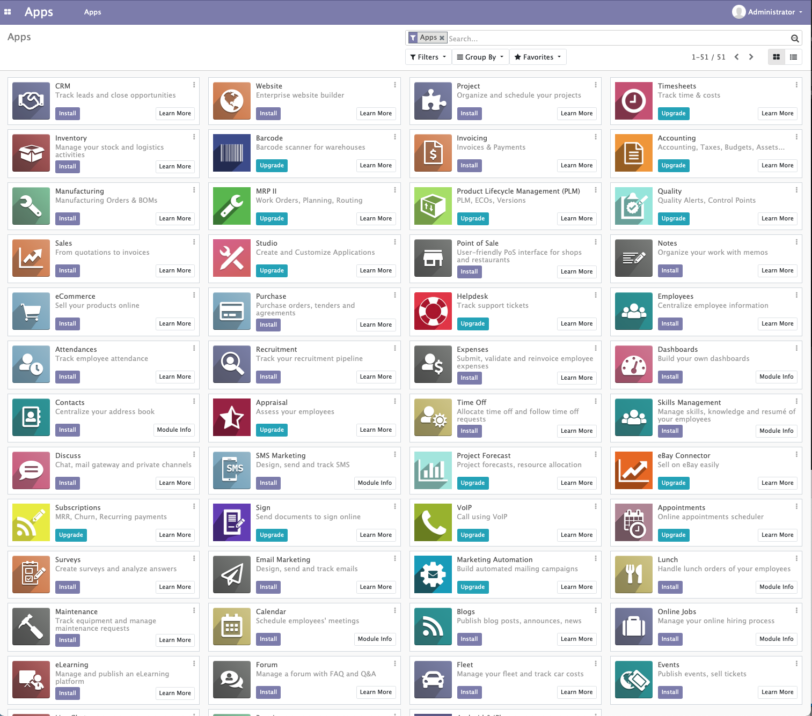
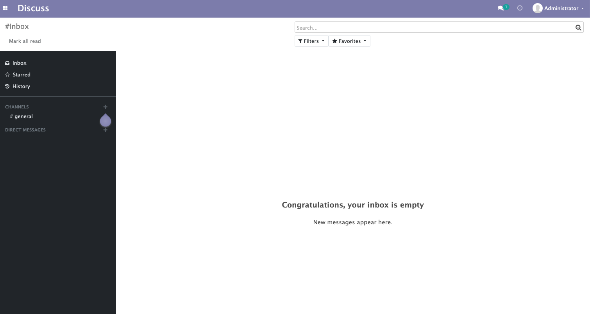
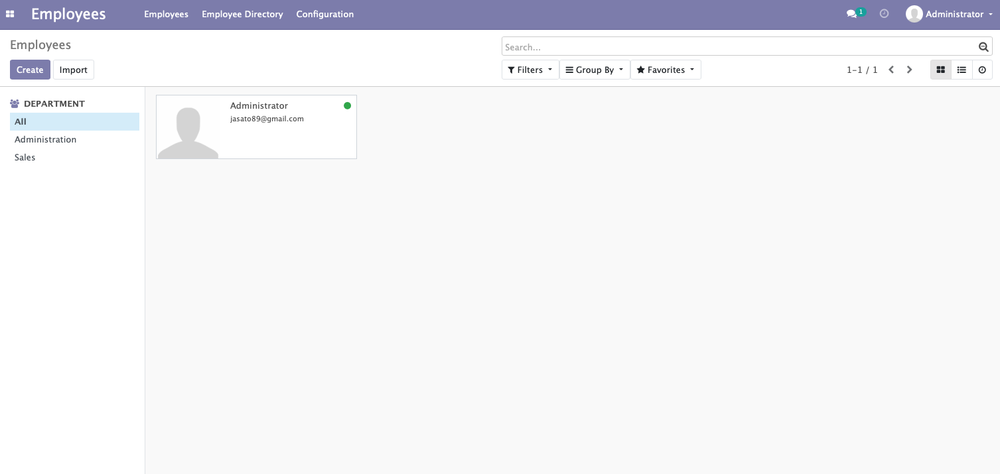
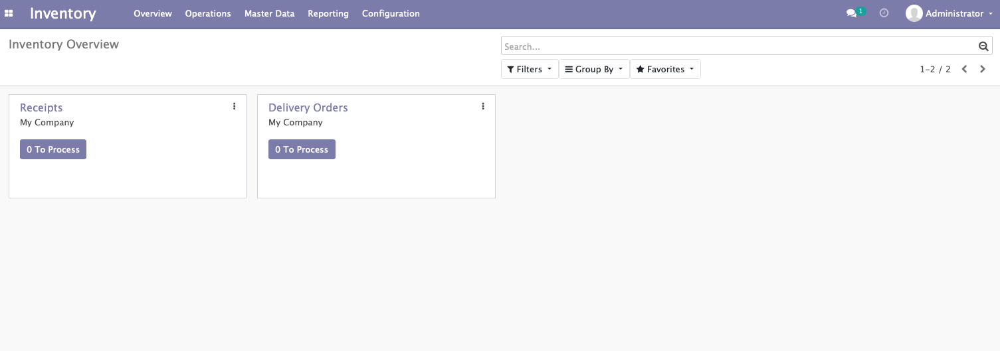
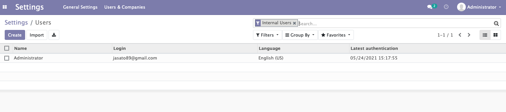
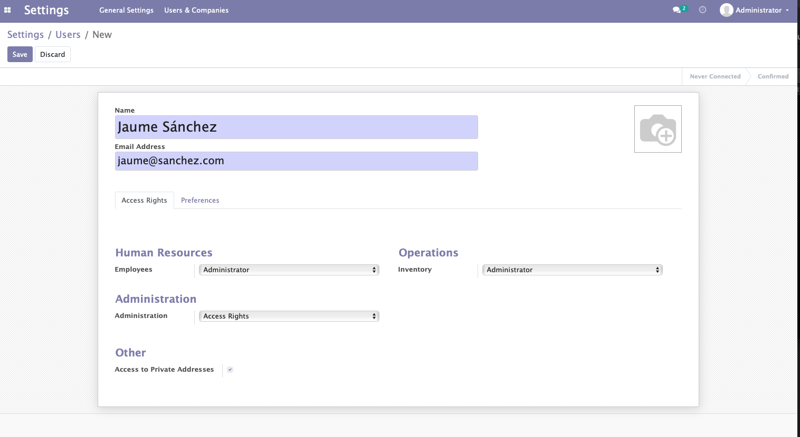
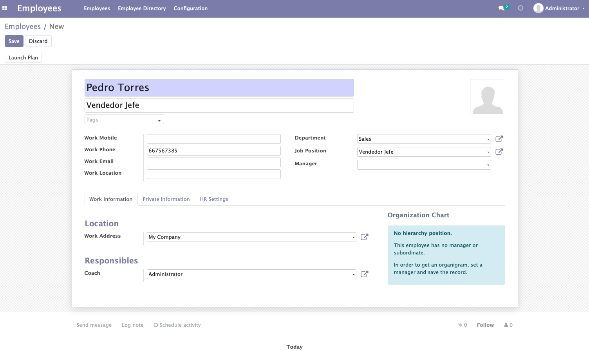

# Practica 2 - Tema 2

## 1. Descripción de la interfaz de Odoo

Odoo se nos presenta con una página de inicio de sesión donde podemos acceder al sistema o crear una base de datos nueva y administrar diferentes bases de datos. 

Una vez iniciada sesión, se nos presentan los disitntos módulos que podemos instalar en nuestro sistema, con una barra de búsqueda y un menú desde el podemos acceder a nuestro perfil y a las preferencias

## 2. Instalación del módulo conversaciones, módulo empleados e inventario.

### Módulo Discuss

### Módulo Employees

### Módulo Inventory

## 3. Creación de diferentes usuarios de Odoo

Para crear usuarios, debemos dirigirnos a Settings/Users y desde ahí podemos proceder a crear los usuarios que queramos:

En la creación de usuarios, podemos modificar los permisos a cada unos de los módulos y secciones del sistema. 

## 4. Creación de empleados

La creación de empleados se hace desde el módulo Employees que hemos instalado previamente:

