# Practica 3 - Tema 3

## 1. Creación de Productos

Para crear productos, debemos acceder al Módulo inventario y dirigirnos a Datos Principales > Productos. Esta es la ficha que debemos cumplimentar para añadir un producto:

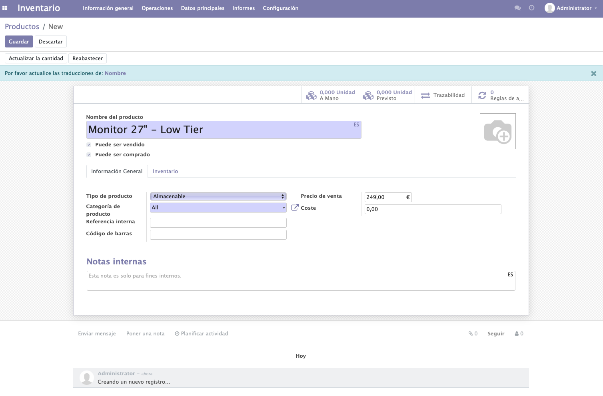

Podemos asignarles distintas categorías a nuestros productos:

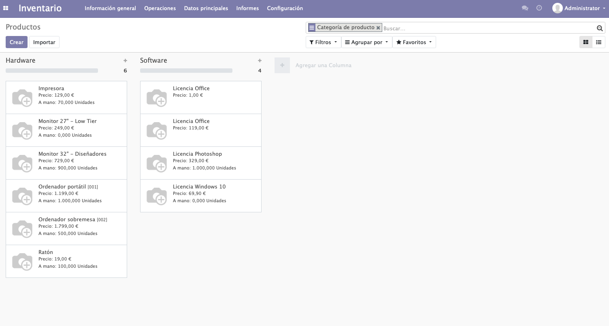

## 2. Creación de almacenes

Para crear almacenes debemos dirigirnos a Configuración > Almacenes

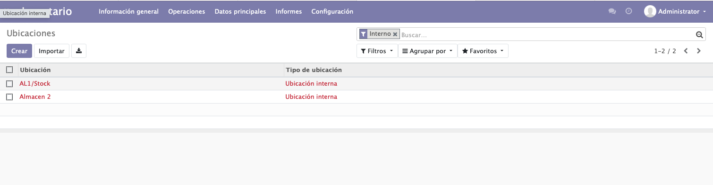

## 3. Proveedores

Si accedemos al módulo de compra, en Pedidos>Proveedores, podemos añadir proveedores.

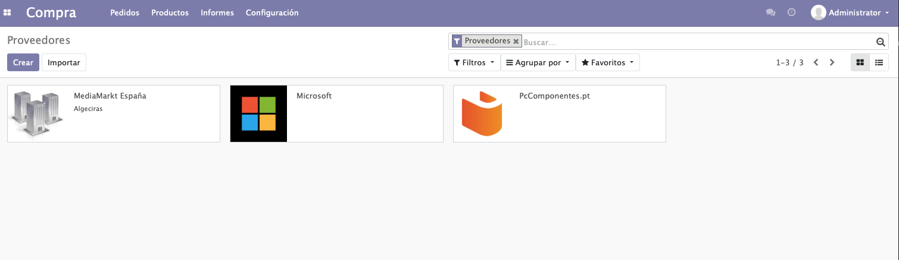

## 4. Creación de clientes

Para crear clientes, accedemos al módulo ventas y accedemos a Pedidos>Clientes:

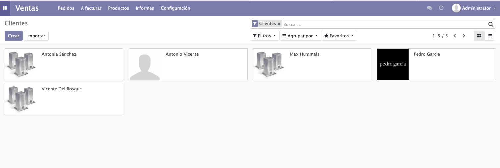

## 5. Compras

Para realizar compras, accedemos al módulo Compras y seleccionamos Solicitar  Presupuesto:

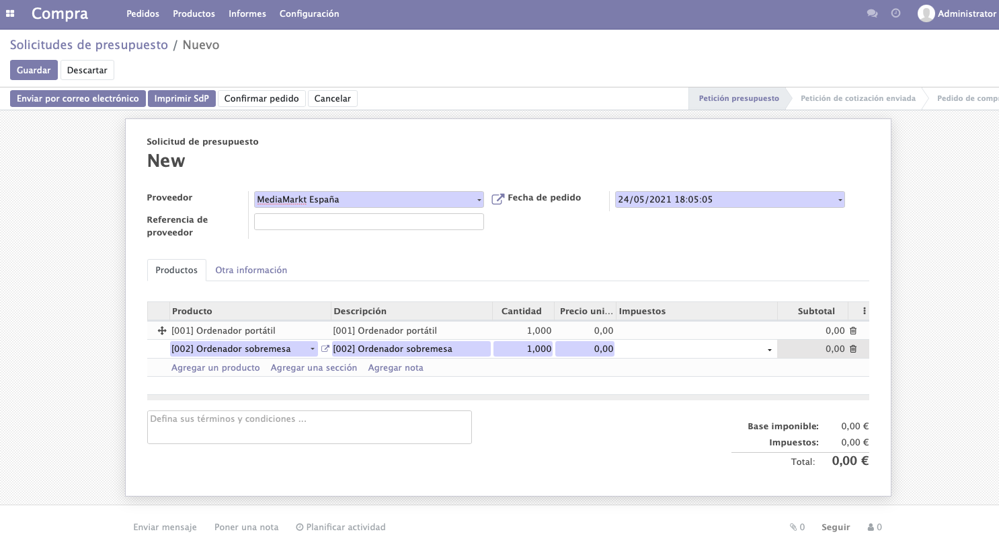

## 6. Comprobación de stock

Una vez enviado el presupuesto y confirmado, podemos recibir el pedido:

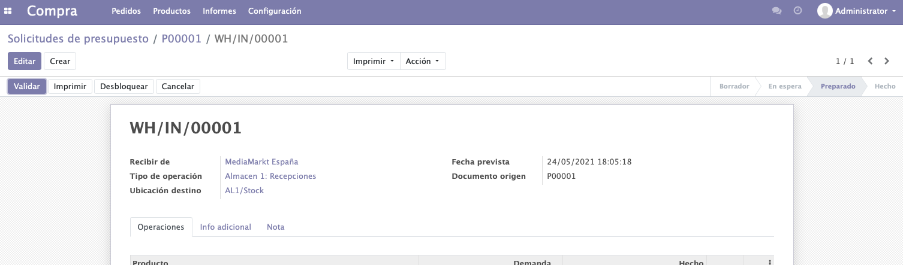

## 7. Realizar ventas

Para realizar ventas, vamos al módulo Ventas y seleccionamos Crear:

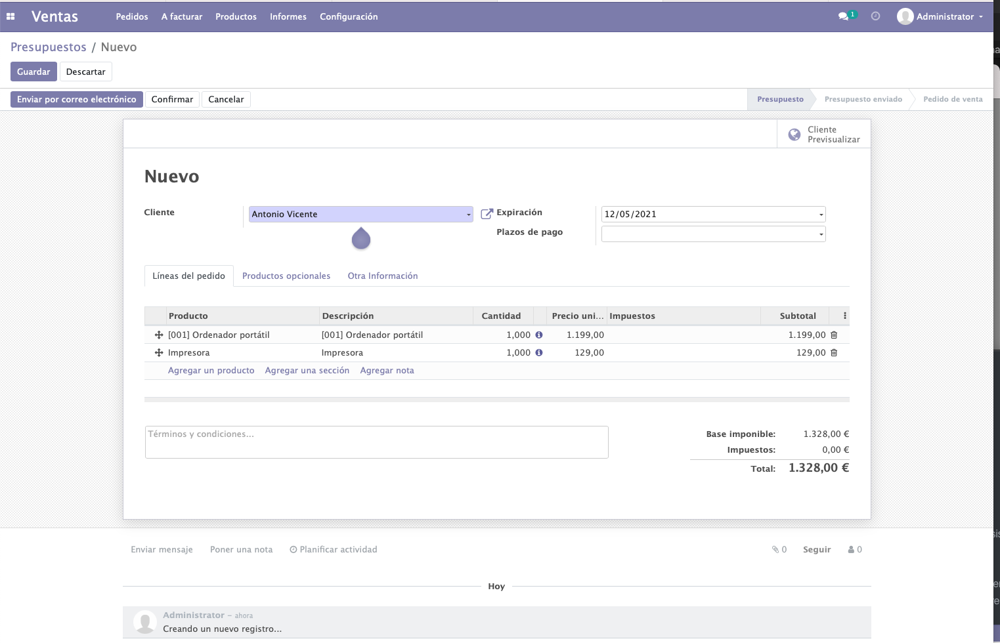

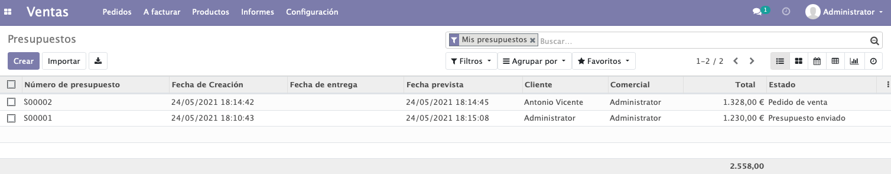

## 8. ¿Cómo se **gestiona el servicio** de Odoo 14 en Ubuntu 20.04?

**Activar** servicio: 

```bash
service odoo-server start
```

**Arrancar** servicio:

```bash
service odoo-server run
```

**Parar** servicio:

```bash
service odoo-server stop
```

**Consultar** estado del servicio:

```bash
service odoo-server status
```

## 9 ¿En qué **ruta** tenemos **instalado Odoo**?

En mi caso, al haber instalado Odoo en un contenedor de Docker basado en Debian, la ruta es /bitnami

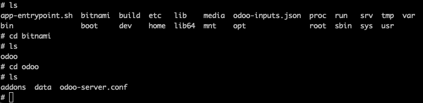

## 10. ¿Cómo podemos **visualizar** el **log** de **Odoo server**? ¿Para qué nos puede servir visualizar dicho fichero?

Al estar corriendo Odoo en un contenedor de Docker, el propio cliente de Docker nos muestra el log en tiempo real. Esto es muy útil porque nos permite ver en tiempo real las acciones que se suceden en el servidor

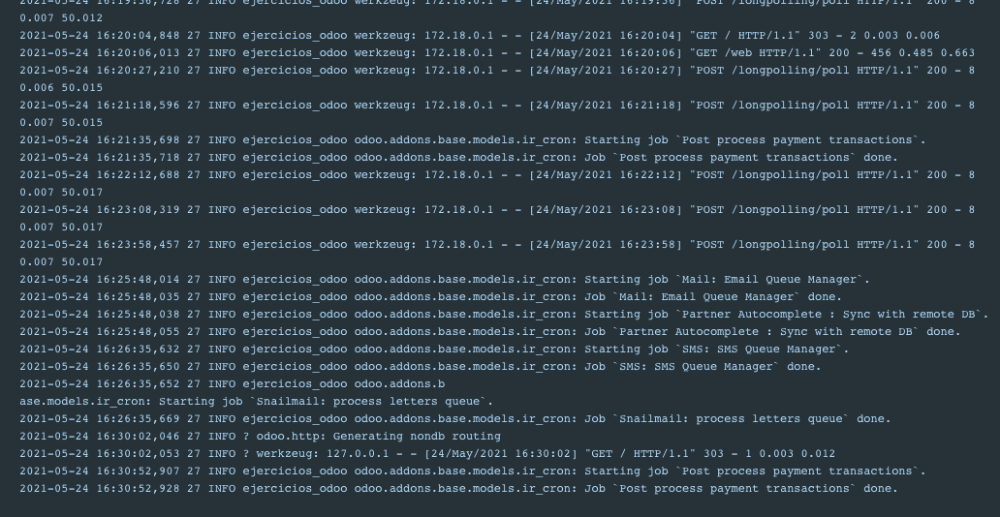

El log nos permite identificar qué problemas están sucediendo en nuestro servidor, las llamadas concretas que se producen a éste y nos permite elaborar un diagnóstico sobre qué está fallando en nuestro servidor.

## 11. ¿En qué **directorio** podemos **encontrar** los **módulos** que tenemos **disponibles en Odoo** para su instalación?

/opt/bitnami/odoo/logs/odoo-server.log

## 12 Si queremos **instalar un módulo que no se encuentra** disponible por defecto, ¿cuáles son los **pasos** que debemos **seguir**? (Instale un módulo y adjunte capturas de pantalla)


